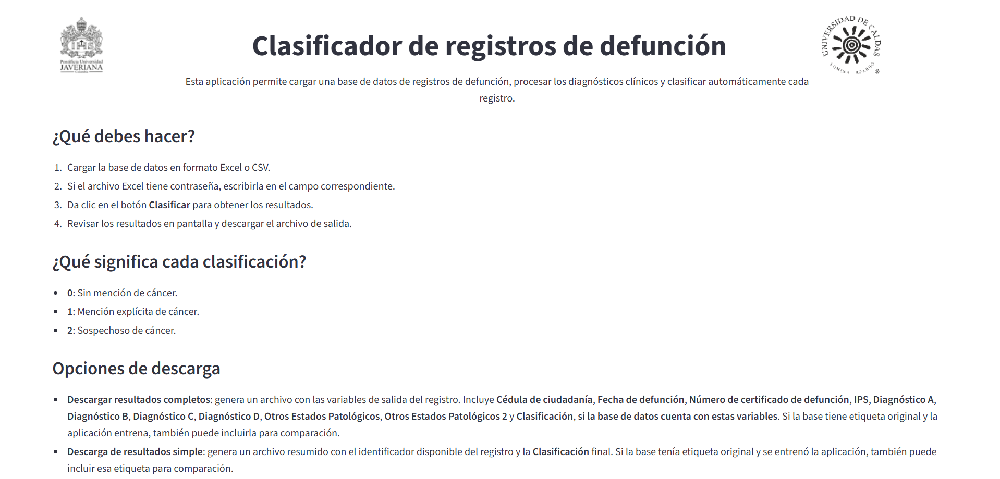

# Clasificador de registros de defunción

Este repositorio contiene una aplicación para clasificar registros de defunción mediante un modelo previamente empaquetado en Docker. La aplicación permite ejecutar el sistema de forma local desde el computador y acceder a una interfaz web desde el navegador.




## Requisitos

Antes de ejecutar la aplicación, es necesario tener instalado y abierto:

* Docker Desktop
* PowerShell
  
## Opción 1: Descargar con Git Clone

Abrir PowerShell en la carpeta donde se desea guardar el proyecto y ejecutar:

```powershell
git clone https://github.com/mafedcp65-netizen/Codigo-registro.git
cd Codigo-registro
.\abrir_app.bat
```

El archivo `abrir_app.bat` descargará automáticamente la imagen Docker desde la sección Releases, la cargará en Docker y ejecutará la aplicación.

Cuando finalice la carga, abrir en el navegador:

```text
http://localhost:8501
```


## Opción 1: Ejecución manual desde Releases

Si se desea ejecutar la aplicación manualmente, descargar el archivo `clasificador-registros.tar` desde la sección **Releases** y dejarlo en la misma carpeta que `abrir_app.bat`.

Luego ejecutar:

```text
abrir_app.bat
```

La aplicación quedará disponible en:

```text
http://localhost:8501
```
